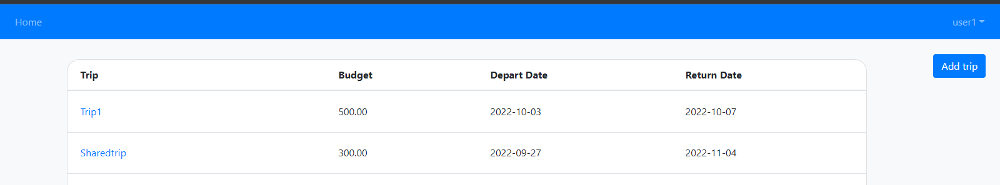
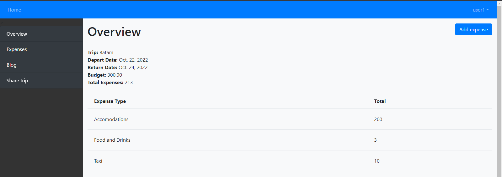
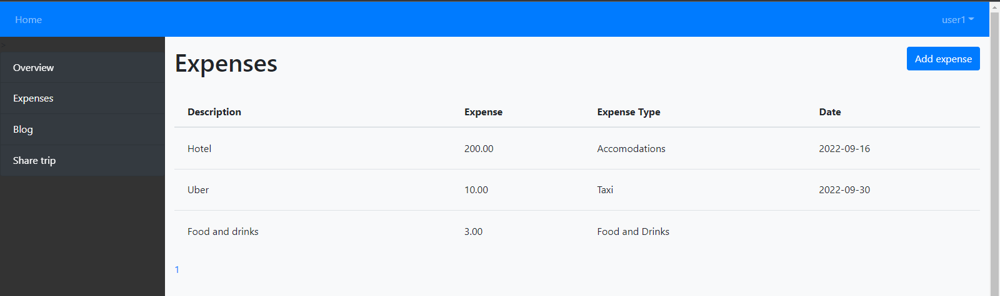
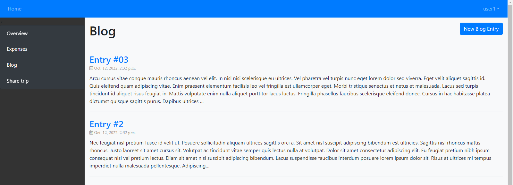
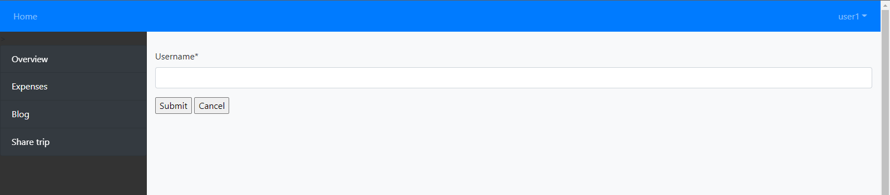

# Django Expense Tracker

## Introduction
Web application using Django framework for tracking expenses. Intention of this application is for users to track their expenses during overseas trip and allowing users to collaborate with their friends to manage the expenses together. Added option to add blog entry to keep track of activities done throughout the trip.

Check out the [hosted version](https://chekahchek.pythonanywhere.com/) of this web app

## Screenshot of web app
1. Homescreen

2. Aggregated view of expenses

3. List of all expenses

4. Blog

5. Share trip to collaborate

